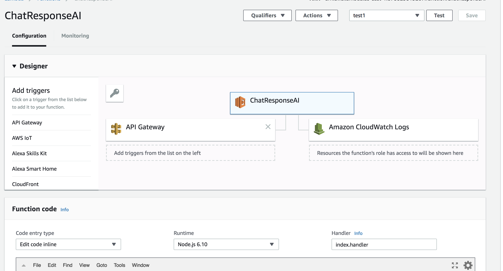
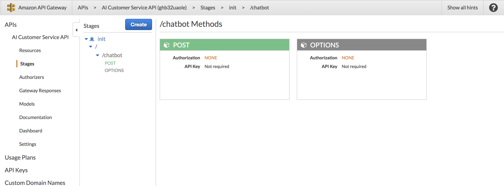
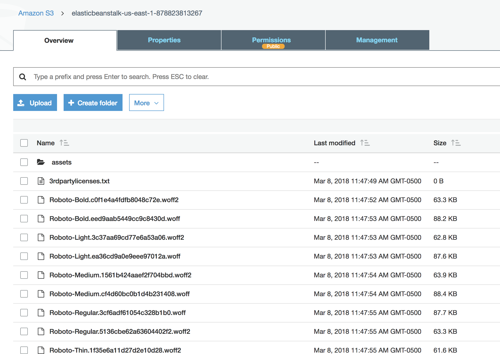
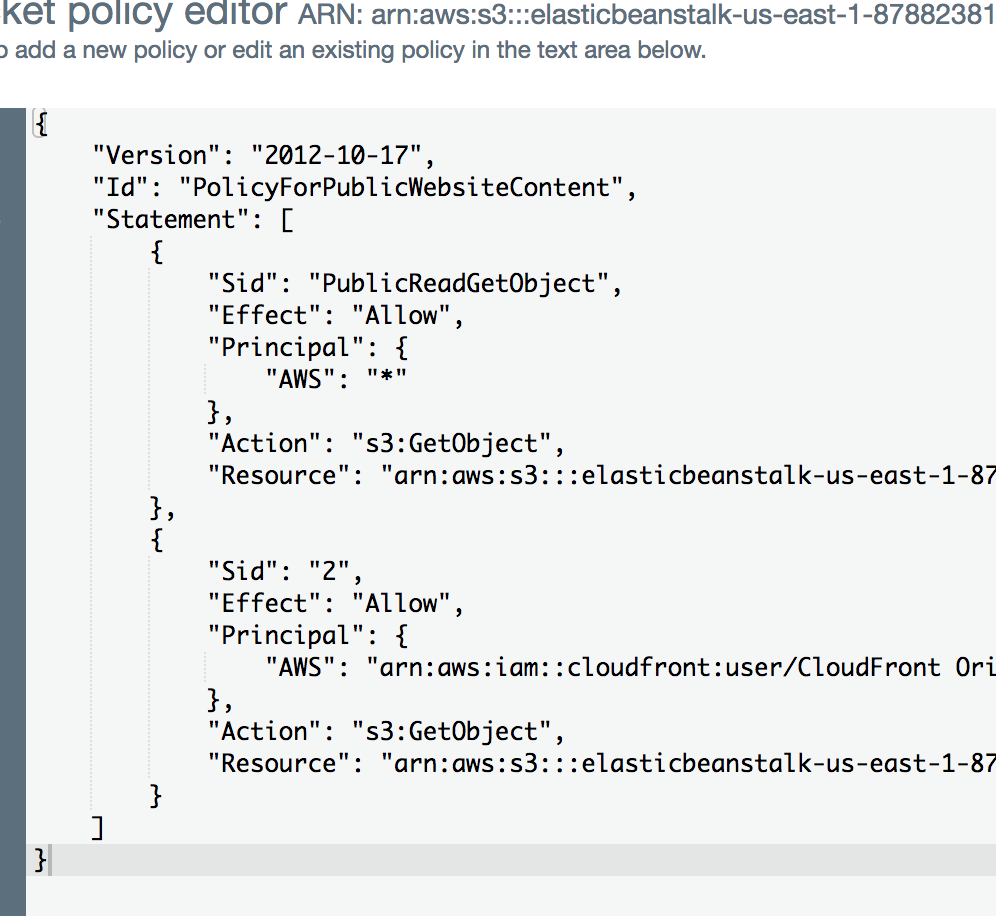

# AIChatApp

Name : Ajay Thorve

Net id: aat414

## 1. Links
   1. <a target="_blank" href= "https://samchatapp.auth.us-east-1.amazoncognito.com/login?response_type=code&client_id=4nhjmiq6aaer3aqd81ck26tmlb&redirect_uri=https://s3.amazonaws.com/elasticbeanstalk-us-east-1-878823813267/index.html">Cognito Auth Page</a>
   2. <a target="_blank" href= "https://s3.amazonaws.com/elasticbeanstalk-us-east-1-878823813267/index.html">S3 bucket</a> 
   
## 2. Source Code

    inside the ./src folder
    
## 3. Lambda function setup and code:

    code in lamda-function.js
    

## 4. API Gateway setup and swagger file

    Swagger content stored in swagger.yaml

## 5. S3 setup and bucket policy

## 6. Cognito Setup

![cognito]
This project was generated with [Angular CLI](https://github.com/angular/angular-cli) version 1.2.7.

## Development server

Run `ng serve` for a dev server. Navigate to `http://localhost:4200/`. The app will automatically reload if you change any of the source files.

## Build

Run `ng build` to build the project. The build artifacts will be stored in the `dist/` directory. Use the `-prod` flag for a production build.

